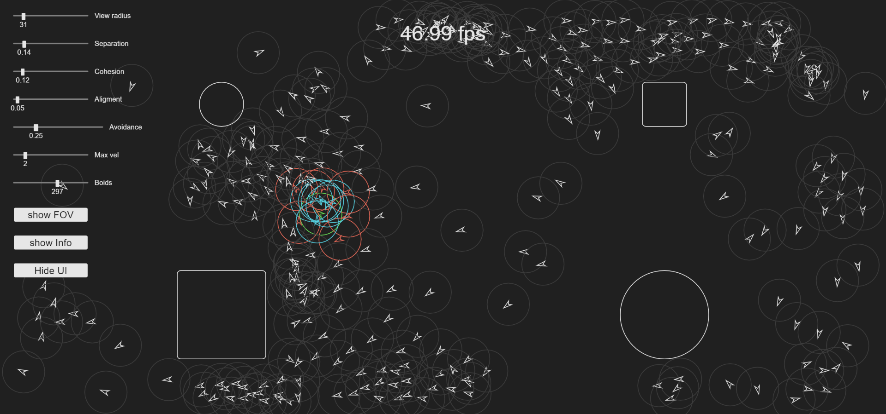

# js-boid_simulation
This is an interactive visualization on Craig Reynolds boids simulations I built using <a href="https://p5js.org/">p5.js</a>.
## URL
This proyect is hosted by github pages at <a href="https://pabloqb2000.github.io/js-boid_simulation/">this link</a>.
## Options
During the simulation you can:
  - Drag the obstacles arround
  - Change the view radius of each boid
  - Change the amount of separation with other boids
  - Change the amount of cohesion with other boids
  - Change the amount of alignment with other boids
  - Change the amount of avoidance to the obstacles
  - Change the maximum velocity of the voids
  - Show the field of view of each void
  - Show information of the simulations, like the fps
  - Hide the UI (enter any key to get it back)
## Screenshot
</img>
## References
To find more information about the <b>awesome</b> library used for this proyect visit:
<a href="https://p5js.org/"> https://p5js.org/ </a>  
Read more about Craig Reynolds boids at <a href="https://www.red3d.com/cwr/boids/">this link</a>
## Other proyects
Checkout my other proyects at <a href="https://pabloqb2000.github.io/Math_visualization/">Click math</a>
